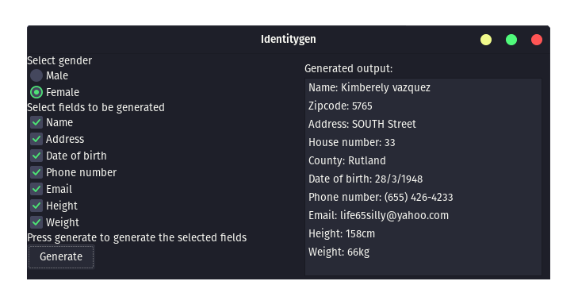

# Identity generator, by Midas van Veen

ik heb een identiteit generator gemaakt in c++. het programma maakt gebruik van wxWidgets voor het maken van een gui. Omdat het gemaakt is door middel van een gui framework is het compatibel met windows, linux en mac.

De bedoeling van dit project is om irritante websites die te veel gebruikers informatie vragen tegen te gaan. als een website bijvoorbeeld vraagt om een adderess en een kloppende zip code, dan kan die gegenereerd worden met de identitygen

## usage

op windows, open het "identitygen.exe" bestand.
op linux voer "./indentitygen" uit in een terminal.
op Mac installeer door middel van het "identitygen.dmg"

selecteer de gewenste vlakken die gegenereerd moeten worden en druk op "Generate".

